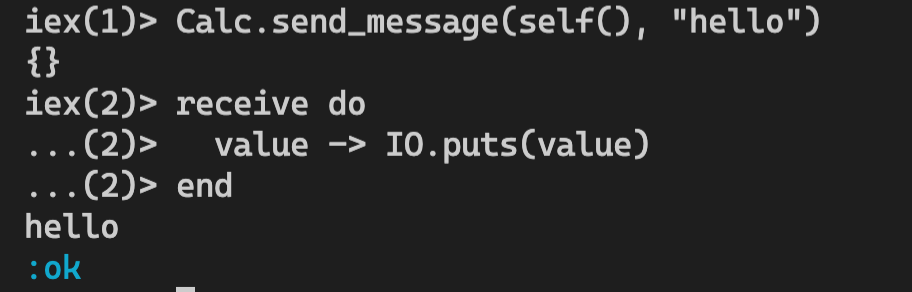
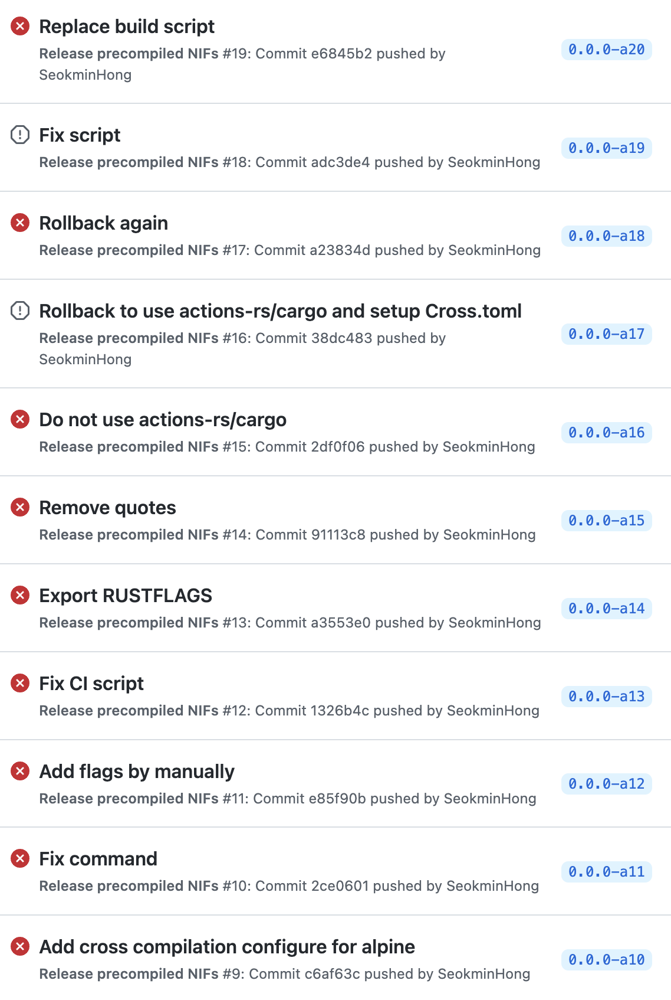
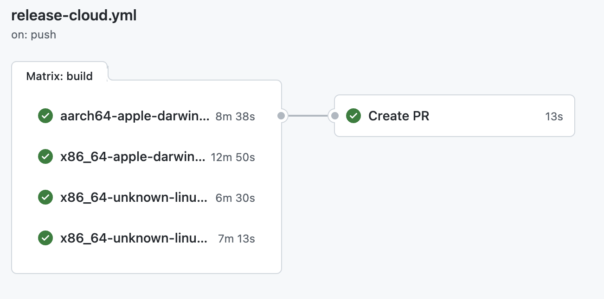
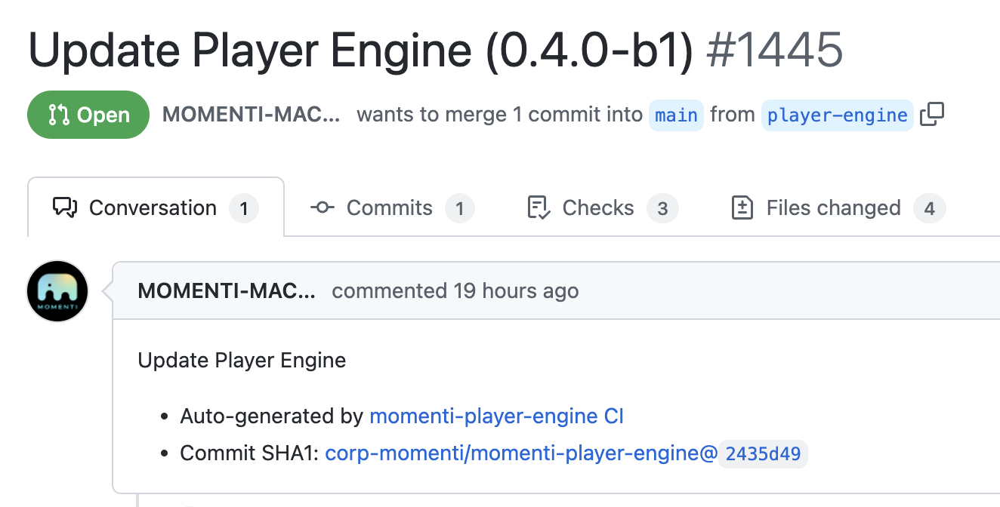

## 발표자

- C++로 게임 개발
- TypeScript/React로 프론트엔드 개발
- 모멘티 코리아 이직 후 Elixir 시작
- Elixir/Phoenix LiveView를 사용, 웹 기반 에디터 구현
- Rustler 프로젝트 기여자

---

## NIFs?

- Native Implemented Functions
- C로 구현된 dynamic library를 Erlang에서 호출
- 런타임에 Erlang 모듈에 연결됨

---

## NIF의 특징

- NIF는 Erlang 에뮬레이터 프로세스에 로드됨
- NIF를 호출할 때 context switch가 없음
- NIF에서 크래시가 발생하면 에뮬레이터 프로세스가 죽음
- 동기적, 짧은 작업 시간, side effect가 없는 함수가 NIF로 적합함

---

## Momenti Uses NIFs

### 요구사항

- 동영상 편집 에디터
- 크로스 플랫폼(MacOS/Linux/iOS/WASM)에서 동작하는 코어 엔진이 필요

---

## Momenti Uses NIFs

### Rust

- 쉬운 크로스 컴파일링
- 충분히 성숙해진 라이브러리와 커뮤니티
- 높은 안정성, 성능

---

## NIF with C

```c++
// lib/calc.h
int add_int(int a, int b)
{
    return a + b;
}
```

---

```c++
// nif_calc.c
#include <erl_nif.h>
#include "lib/calc.h"
static ERL_NIF_TERM add_int_nif(
    ErlNifEnv *env,
    int argc,
    const ERL_NIF_TERM argv[]
) {
    int a, b, result;
    enif_get_int(env, argv[0], &a);
    enif_get_int(env, argv[1], &b);
    result = add_int(a, b);
    return enif_make_int(env, result);
}
```

---

## 용어

- `term`: Erlang에서 piece of data를 타입에 상관 없이 칭하는 단어
- `env`: Erlang terms들이 바운드된 environment
- `enif_get_*`: 주어진 term으로부터 원하는 타입의 값을 읽음
- `enif_make_*`: C의 값을 term으로 인코딩함

---

```c++
// nif_calc.c
static ErlNifFunc nif_funcs[] = {
    // {function name, arity, function ptr}
    {"add_int", 2, add_int_nif},
};

ERL_NIF_INIT(Elixir.Calc, nif_funcs, NULL, NULL, NULL, NULL)
```

---

```elixir
defmodule Calc do
  @on_load :load_nifs

  def load_nifs do
    :erlang.load_nif('native/nif_calc', 0)
  end

  def add_int(_a, _b), do: error()

  defp error(), do: :erlang.nif_error(:nif_not_loaded)
end
```

---

## Build / Link

```sh
gcc -o lib_calc.so -c lib/calc.c

export INCLUDES=-I/{ERLANG_PATH}/usr/include
# x86
gcc $INCLUDES -shared -o nif_calc.so -fPIC nif_calc.c lib_calc.so
# ARM
gcc $INCLUDES -o nif_calc.so -undefined dynamic_lookup -dynamiclib nif_calc.c lib_calc.so
```

---

```elixir
iex> Calc.add(1, 2)
3
```

---

## 문제점

- 모든 인자와 반환값을 직접 인코딩/디코딩해야 함
- 바인딩 로직을 직접 작성해야 함
- 빌드 과정이 번거로움

---

## Rustler


https://github.com/rusterlium/rustler

---

## Rustler

- Rust로 NIF에 안전하게 바인딩할 수 있는 인터페이스를 제공
- Rust의 문법을 Elixir에 적절히 대응하여 _자연스러운_ 바인딩 가능
- Rust에서 크래시가 발생해도 프로세스가 다운되지 않음
- 빌드가 간편함

---

```rust
#[rustler::nif]
fn add(a: i64, b: i64) -> i64 {
    a + b
}

rustler::init!("Elixir.Calc", [add]);
```

---

```elixir
defmodule Calc do
  use Rustler, otp_app: :rustler_nif, crate: :calc

  @spec add(integer(), integer()) :: integer()
  def add(_a, _b), do: error()

  defp error(), do: :erlang.nif_error(:nif_not_loaded)
end
```

---

## How it works

- Rust의 매크로를 사용
- 바인딩 코드를 자동 생성

---

## `cargo-expand`

https://github.com/dtolnay/cargo-expand

- Rust의 매크로를 expand하여 최종 결과를 보여주는 도구

---

```rust
pub struct add;
impl rustler::Nif for add {
    const NAME: *const u8 = "add\u{0}".as_ptr() as *const u8;
    const ARITY: u32 = 2u32;
    const FLAGS: u32 = rustler::SchedulerFlags::Normal as u32;
    const RAW_FUNC: unsafe extern "C" fn(
        nif_env: rustler::codegen_runtime::NIF_ENV,
        argc: rustler::codegen_runtime::c_int,
        argv: *const rustler::codegen_runtime::NIF_TERM,
    ) -> rustler::codegen_runtime::NIF_TERM = {
        ...
    };
}
```

---

```rust
let result: std::thread::Result<_> = std::panic::catch_unwind(move || {
    let a: i64 = match args[0usize].decode() {
        Ok(value) => value,
        Err(err) => return Err(err),
    };
    let b: i64 = match args[1usize].decode() {
        Ok(value) => value,
        Err(err) => return Err(err),
    };
    fn add(a: i64, b: i64) -> i64 {
        a + b
    }
    Ok(add(a, b))
});
```

---

## Rustler <-> Elixir

- Elixir와 Rust의 자료형을 _자연스럽게_ 이어줌
- 유저 정의 타입에 매크로를 사용하여 변환 가능
- Rust의 매크로가 encode/decode 로직을 작성해줌

---

### Enum

```rust
#[derive(NifTaggedEnum)]
pub enum Test {
    A,                   // :a
    B,                   // :b
    Int(i32),            // {:int, integer()}
    TwoFloats(f64, f64), // {:two_floats, float(), float()}
}
```

---

### Struct <-> Map

```rust
#[derive(NifMap)]
pub struct Test {
    a: i32,
    b: f64,
}
// %{a: integer(), b: float()}
```

---

### Struct <-> Struct

```rust
#[derive(NifStruct)]
#[module = "SomeModule.Test"]
pub struct Test {
    a: i32,
    b: f64,
}
// %SomeModule.Test{a: integer(), b: float()}
```

---

## 함수 입력 및 출력 단순화

- 함수의 인자는 decode 가능한 타입이면 전부 가능
- 함수의 첫 번째 인자에 선택적으로 `env`를 사용 가능
- 함수의 반환 타입은 encode 가능한 타입이면 전부 가능
- 함수의 반환 타입으로 `NifResult` 허용

---

```rust
#[nif]
fn send_message(env: Env, pid: LocalPid, message: String) {
    let msg = message.encode(env);
    env.send(&pid, msg);
}
```

```elixir
@spec send_message(pid(), binary()) :: no_return()
def send_message(_pid, _msg), do: error()
```



---

```rust
#[nif]
fn add(a: f64, b: f64) -> f64 {
    a + b
}

#[nif]
fn div(a: f64, b: f64) -> NifResult<f64> {
    if b == 0.0 {
        // :div_by_zero = div(1.0, 0.0)
        Err(Error::Atom("div_by_zero"))
    } else {
        Ok(a / b) // 10.0 = div(1.0, 0.1)
    }
}
```

---

## 시행착오

---

### 긴 빌드 시간

- Rust는 의존성이 더 많음
- 빌드 캐시가 되지 않는 CI 환경에서 두드러짐

---

### `rustler_precompiled`

https://github.com/philss/rustler_precompiled

- 바인딩 crate를 GitHub Releases로부터 바로 가져올 수 있는 라이브러리

---

```elixir
defmodule Example.Native do
  version = Mix.Project.config()[:version]

  use RustlerPrecompiled,
    otp_app: :rustler_precompilation_example,
    crate: "example",
    base_url:
      "https://github.com/philss/rustler_precompilation_example/releases/download/v#{version}",
    version: version

  # When your NIF is loaded, it will override this function.
  def add(_a, _b), do: :erlang.nif_error(:nif_not_loaded)
end
```

---

### 단점

- 배포 파이프라인에 커스터마이징이 힘듦
- 아직 개발 초기 단계임

---

### 직접 구축하자!

- Rustler의 `load_from` 및 `skip_compilation?` 플래그로 사전에 빌드한 라이브러리를 사용 가능
- Crate 배포 시 실행할 플랫폼들을 대상으로 빌드
- GitHub Releases에 빌드된 파일 추가
- Elixir 레포지토리에 PR을 자동생성하여, 빌드된 파일을 푸시

---

### 🌋



---

### Alpine build

- GitHub CI의 Linux 환경은 Ubuntu만 제공
- Ubuntu에서 Rust의 기본 툴체인으로 Alpine 타깃 빌드를 하면 `glibc`를 사용함
- Alpine에는 `glibc`가 없기 때문에 실행 불가능

---

### `cross`

https://github.com/cross-rs/cross

- Rust의 cross compiliation 툴
- 원하는 타깃의 Docker daemon을 띄워 그 안에서 빌드
- ✅

---

### Ubuntu binary size


- Ubuntu에서 빌드할 때 바이너리 크기가 지나치게 큼
- Ubuntu에서 Rust 공유 라이브러리 빌드 시, 디버그 심볼이 들어가는 버그
- https://users.rust-lang.org/t/binary-is-way-bigger-on-linux-than-on-macos/14814/3

---

### `strip`


```sh
$ strip -S ${LIB_FINAL_NAME}
```

- 빌드 후 디버그 심볼을 강제로 제거
- ✅

---




---

### 비동기!

- NIF는 기본적으로 동기적 함수를 호출하는 것을 전제함
- 코어 엔진은 비동기 호출 위주인데 가능할까?

---

```rust
async fn some_task(task_ended: Callback<SomeTask>) {
    job().await;
    task_ended.invoke(payload);
}
```

🤔

---

```rust
#[nif]
fn start_some_task(pid: LocalPid) {
    thread::spawn(move || {
        runtime.block_on(async {
            some_task(Callback{ pid }).await
        });
    });
}
#[cfg(feature = "elixir")]
impl Callback<SomeTask> {
    fn invoke(&self, payload: SomeTaskPayload) {
        OwnedEnv::new().send_and_clear(self.pid, move |env| {
            ("some_task", payload).encode(env)
        });
    }
}
```

```elixir
Example.start_some_task(self())
receive do
  {"some_task", payload} -> payload
end
```

✅

---

## References

- Erlang NIFs Document: https://www.erlang.org/doc/tutorial/nif.html
- `erl_nif` manual: https://www.erlang.org/doc/man/erl_nif.html
- Elixir and NIF: a study case: https://dev.to/rodrigocaldeira/elixir-and-nif-a-study-case-2npp

---

## 감사합니다

예제 코드 및 구체적인 구현은

다음 저장소에서 보실 수 있습니다.

https://github.com/SeokminHong/nif-elixir-example

PDF: https://github.com/SeokminHong/presentations/raw/main/pdfs/nif.pdf
